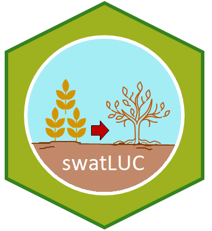

# swatLUC 

> Simple way of creating land use change scenarios for SWAT+. The users are able to *i)*\ generate the meteorological input files using either ground-based measurements or gridded datasets; *ii)*\ create land use change scenarios in a friendly way; and *iii)*\ analyse and visualise the model outputs.

### Installation

Install development version from GitHub :

```r
remotes::install_github("obaezvil/swatLUC")
```
